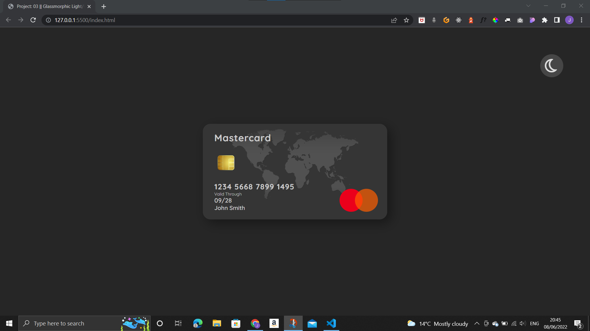

# 03_glassmorphicLightDark

## Description

These projects are all part of 50 different smaller practice projects that I plan to complete over the comming weeks to proactice HTML, CSS, and JavaScript. They will be small in scope but will help me refresh differen aspects of front end developement. This is the third project a credit card created using css with a translucent background.  
The card is white set against a white background but when the the toggle button is clicked the background and the card turn dark.  
The first image below is what the card looks like on a white background. Notice that the toggle button is a sun symbol indicating that this is the light theme.  

The second image shows what the card looks like once the toggle button has been clicked. The background gets darker as well as the card and the toggle icon is now a half moon symbol indicating that this is the dark theme.

 
This project was created using HTML, CSS, and JavaScript. The JavaScript adds an event listner to the toggle button which adds or removes a dark class to the container, this makes the changes on the page.

## Demo

A demo of the project can be found here: https://tod619.github.io/03_glassmorphicLightDark/
